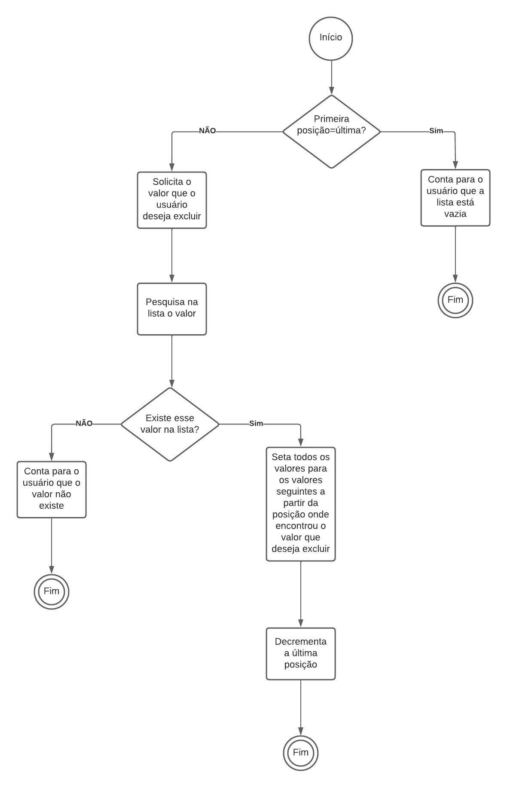

<h1>Exercicio 1</h1>

Diagramas de inserção, remoção e pesquisa em uma lista linear.

<h2>Problema:</h2>

 Faça um diagrama para representar uma inserção, remoção e pesquisa em uma lista linear

<h2>Resolução:</h2>
<h3>Inserção:</h3>

<h3>Remoção:</h3>

<h3>Pesquisa:</h3>

